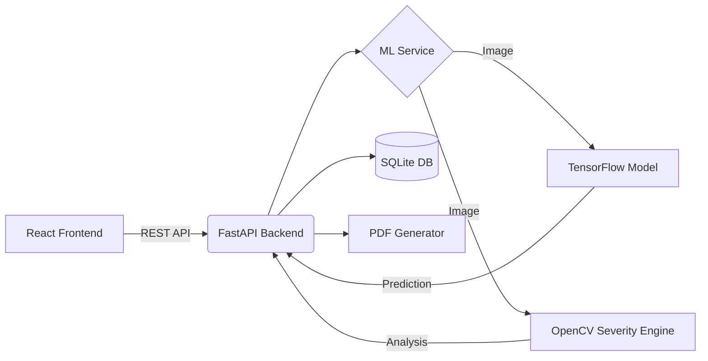

<div align="center">
  <h1>🌱 FarmGuardian AI</h1>
  <p><b>Early Crop Disease Detection & Yield Loss Prevention System</b></p>
  <p>
    
    
    
    
  </p>
</div>

## 🌍 The Problem
Farmers often identify crop diseases only after visible damage has spread. This late detection results in significantly reduced crop yields, increased pesticide costs, and devastating financial losses, especially for smallholder farmers.

## 🚀 Our Solution
**FarmGuardian AI** is a production-grade, AI-powered platform that acts as a pocket agronomist. By simply uploading a photo of a leaf, farmers get instant disease identification, severity assessment, and actionable treatment recommendations in their native language.

### ✨ Key Features
*   **🦠 Instant Disease Detection:** Identifies 38 different plant diseases using a fine-tuned MobileNetV2 model.
*   **📊 Severity & Yield Impact:** Calculates lesion coverage to estimate severity (Mild/Moderate/Severe) and predicts potential financial loss.
*   **💊 Actionable Treatment:** Provides immediate actions, organic solutions, and chemical treatments based on the specific disease.
*   **📄 Field Health Reports:** Upload multiple images to generate a comprehensive, downloadable PDF health report for an entire field.
*   **🌐 Multilingual Support:** Built-in localization for English, Telugu, and Hindi to ensure accessibility for rural communities.

## 🏗️ Architecture



## 🛠️ Installation & Setup

### Prerequisites
*   Node.js (v18+)
*   Python (3.10+)

### 1. Clone the Repository
```bash
git clone https://github.com/yourusername/farmguardian-ai.git
cd farmguardian-ai
```

### 2. Backend Setup
```bash
cd backend
python -m venv venv
# Windows: venv\Scripts\activate
# Mac/Linux: source venv/bin/activate
pip install -r requirements.txt
uvicorn app.main:app --reload
```
*The backend runs on `http://localhost:8000`*

### 3. Frontend Setup
```bash
cd frontend
npm install
npm run dev
```
*The frontend runs on `http://localhost:5173`*

## 🧠 Machine Learning Pipeline
The `/ml` directory contains the full pipeline for training the model on the **PlantVillage dataset** (~54,000 images).
*   Model Architecture: MobileNetV2 (Transfer Learning)
*   Training strategy involves feature extraction followed by fine-tuning top layers.
*   *Note: For the hackathon demo, the backend includes a fallback simulation mode if a trained `.h5` model is not present, allowing the UI and APIs to be tested immediately.*

## 🛣️ Future Roadmap
- [ ] Offline Edge AI Support via TFLite mobile apps
- [ ] Integration with hyper-local weather APIs to predict fungal outbreak conditions
- [ ] Drone imagery analysis for large-scale commercial farms

## 📄 License
This project is licensed under the MIT License.
