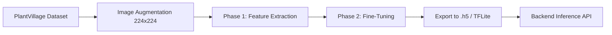

# FarmGuardian AI Architecture

This document outlines the system architecture of the FarmGuardian AI platform.

## High-Level Architecture

```mermaid
graph TD
    Client[Client App (React + Vite)]
    Backend[FastAPI Backend]
    DB[(SQLite Database)]
    ML[MobileNetV2 Model]
    PDF[PDF Generator (ReportLab)]
    
    Client -->|REST API| Backend
    Backend -->|Read/Write| DB
    Backend -->|Image Data| ML
    ML -->|Predictions| Backend
    Backend -->|Scan Data| PDF
    PDF -->|Report URL| Backend
    Backend -->|JSON Responses| Client
```

## Machine Learning Pipeline



## Data Flow: Disease Detection

1. **Upload**: User uploads an image via the React frontend.
2. **API Request**: The image is sent to `POST /api/predict`.
3. **ML Inference**: `ml_service` preprocesses the image and passes it to the MobileNetV2 model.
4. **Severity Analysis**: `severity_engine` uses OpenCV to calculate lesion coverage.
5. **Yield Prediction**: `yield_predictor` estimates potential yield loss based on disease type and severity.
6. **Recommendations**: `recommendation_engine` fetches treatment advice in the requested language.
7. **Storage**: The scan result is saved to the SQLite database.
8. **Response**: A comprehensive JSON response is returned to the frontend.

## Technology Stack Justification

*   **Frontend**: React + Vite + Tailwind CSS provides a fast, responsive, and visually appealing user interface, crucial for a modern AgriTech application.
*   **Backend**: FastAPI was chosen for its high performance, native async support, and built-in data validation with Pydantic, making it ideal for serving ML models.
*   **Machine Learning**: MobileNetV2 offers an excellent balance between accuracy and computational efficiency, allowing for fast inference even on constrained server environments.
*   **Database**: SQLite is used for the MVP due to its simplicity and zero-configuration setup, making it perfect for hackathon rapid prototyping.
